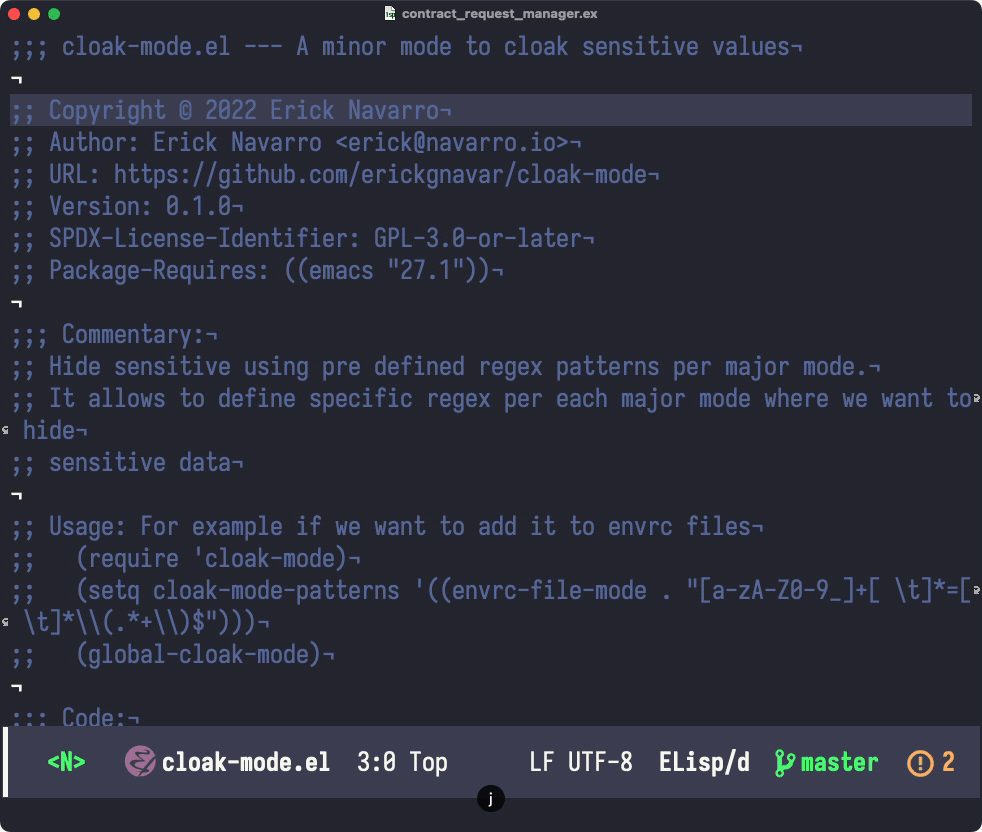

# cloak-mode

Minor mode to cloak sensitive data

## Motivation

I used to use `hidepw` package but it only supports a plain list of regexs and also use font locking which have some conflicts with other packages, `cloak-mode` allows to setup a regex by major mode, which fits betters for my use case.

## Demo



## Installation

### Cloning the repo

Clone this repo somewhere, and add this to your config:

```elisp
(add-to-list 'load-path "path where the repo was cloned")

;; for example we load it for envrc files
(require 'cloak-mode)
(setq cloak-mode-patterns '((envrc-file-mode . "[a-zA-Z0-9_]+[ \t]*=[ \t]*\\(.*+\\)$")))
(global-cloak-mode)
```

### Using straight.el

```emacs-lisp
(use-package cloak-mode
  :straight (cloak-mode
             :type git
             :host github
             :repo "erickgnavar/cloak-mode"))
```
